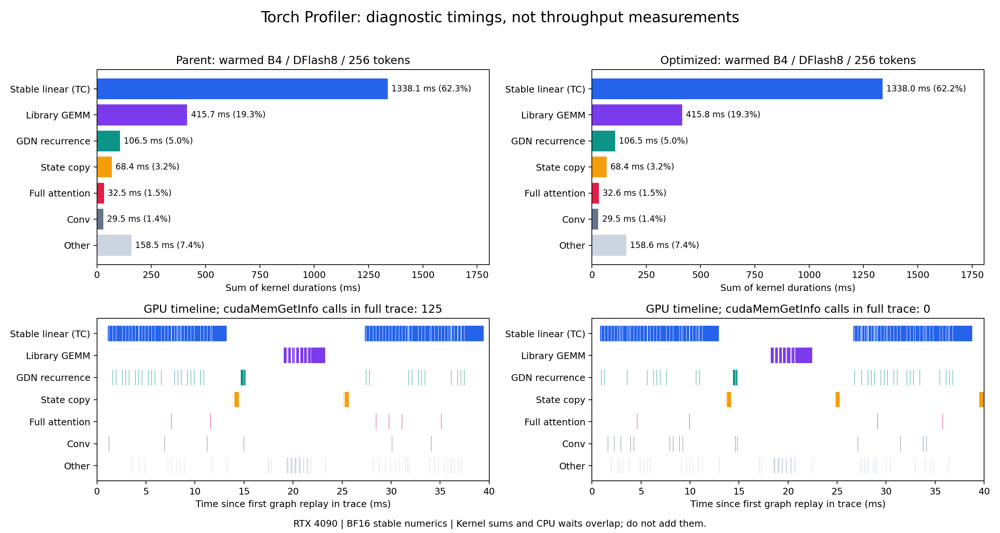

# MiniSGLang Qwen3.5：Profiler 定位、优化与 GPU 验证

日期：2026-09-20。实验仓库 `/root/mini-sglang`，分支 `feat/hybrid-memory-runtime`。

## 结论

MTP 和 DFlash 在本次测试的 BF16 greedy 场景中，与**同版 stable target-only** 的输出 token IDs 完全一致。batch 4、输出 256/512 token、CUDA Graph 开启时，两种投机方式均快于 target-only。不能将这个结论推广到所有并发、输出长度、采样方式或其他框架。

本轮真正合入的性能改动是显存准入的 CPU 快路径，不是重写 GPU 算子。初次前后计时高估了收益；交错 ABBA 复测仅观察到 DFlash 平均约 **1.2%**、MTP 约 **0.6%** 的提升，结果区间重叠，不宣称显著提速。更重要的交付是修复了 continuous batching 的预热覆盖问题，并建立可复现的 profiler、准确性和性能验证流程。

## 环境与比较口径

- RTX 4090，24GB；驱动 595.71.05；PyTorch 2.9.1+cu128、CUDA 12.8、Triton 3.5.1。
- Target：`/root/autodl-tmp/models/hybrid-runtime/Qwen3.5-4B`。
- Draft：`/root/autodl-tmp/models/hybrid-runtime/Qwen3.5-4B-DFlash`。
- BF16、greedy、stable target numerics、packed GDN、parallel verify、CUDA Graph 开启；GPU/CPU prefix cache 均关闭。
- MTP3 表示最多递归 draft 3 token，含 anchor 的 verify block 最大为 4；DFlash8 的 block 含 anchor，最多提出 7 个 draft token。
- 表中的吞吐是输出 token 总数除以 wave wall time，包含 prefill，排除加载和指定 warmup；不是各请求吞吐之和，也不是纯 decode 速度。
- 256/512 测试每模式 warmup 2 次、测量 5 个 batch，共 20 个请求，来自 4 个重复 prompt。另有独立 8-prompt、补槽、高并发、长上下文回归，不能把重复请求数当独立任务覆盖率。
- 未锁 GPU 时钟；记录了 telemetry。微小百分比收益应保留噪声解释。Profiler 的时间绝不用于吞吐门槛。

## 抓图结果与瓶颈



图中百分比以 CUDA kernel duration 总和为分母，不含 memcpy，因此和 profiler 表格的 `Self CUDA %` 略有差别。时间线是实际 trace 中首次 graph replay 开始的 40ms 片段；空白不能单独证明某类硬件瓶颈。

| DFlash8 / batch 4 / 256 输出 | 优化前 kernel 时间 | 占比约 |
|---|---:|---:|
| stable linear | 1338.1 ms | 62.3% |
| library GEMM | 415.7 ms | 19.3% |
| GDN recurrence | 106.5 ms | 5.0% |
| state copy | 68.4 ms | 3.2% |
| full attention | 32.5 ms | 1.5% |
| convolution | 29.5 ms | 1.4% |

主要发现：

1. 优先关注 linear，而非仅凭“hybrid architecture”猜测 GDN 是主要瓶颈。即使完全消除 state-copy kernel，其 GPU 时间上限也只有约 3.2%，不能据此承诺很大的端到端收益。
2. stable linear 的 Triton 编译产物包含 `mma.sync.aligned.m16n8k16.row.col.f32.bf16.bf16.f32`，确实使用 Tensor Core。Triton 和手写 CUDA 不是“是否使用 TC”的划分。
3. CPU profile 中 `feasible_blocks` 每轮查询驱动显存；该波次 `cudaMemGetInfo` 共 **125 次、累计约 202ms**。这些是 profiler 下的 CPU 时间，不能直接换算成无 profiler 的加速比。
4. `Tensor.tolist()` 的累计时间包含 GPU 等待。不能看到它排第一就判断是 Python 列表转换计算太慢。CPU wait 与 GPU kernel 时间重叠，不能相加。

优化后的 trace 中，驱动显存查询变成 **0 次**；stable linear 仍约 1338.0ms，其他 GPU kernel 时间也基本相同。这证明本轮改变的是 host 调度开销，没有通过更换数值计算路径来换取速度。

本环境 PATH 中没有找到 nsys/ncu/compute-sanitizer，使用现有 Torch Profiler 和 cProfile；没有为了抓图重装推理环境，也没有声称获得 DRAM 带宽等硬件计数器证据。

## 实际代码修改

### 1. 显存准入的保守快路径

文件：`python/minisgl/speculative/target.py`；提交 `45de46e`。

原逻辑分别读取 allocated/reserved，然后每轮调用驱动 `mem_get_info`。现在一次读取 allocator statistics，并先计算：

```text
pooled_available = min(reserved - allocated, configured_budget - allocated)
```

如果按照**原有准入估算**，这个值已足够容纳全部候选 block，就无需查询驱动；否则仍使用原来的驱动剩余显存、checkpoint、workspace、safety 和 cache 回收检查。

这不是缓存一个过期的 free-memory 数字，也没有删除显存余量。由于驱动 free bytes 非负，快路径只是对原计算的保守判定；5 个 CPU 测试覆盖池内满足、必须查询、容量上限、无可用空间和部分候选可行等分支，与原准入 oracle 比对。现有预算本身仍是估算，不是解决碎片、graph 私有池和并发外部进程的硬 OOM 保证。

### 2. 修复 continuous batching 的预热覆盖

文件：`python/minisgl/runtime/benchmark.py`；提交 `4f59dc2`。

旧 benchmark 只预热 `rows[:batch_size]`；测量 continuous refill 时却执行整个请求队列。后续补槽触发的新 shape 编译和 graph capture 可能落入计时区间。最初 DFlash ragged 172 tok/s 与后来的 254 tok/s，不能全部归因于 runtime 优化。

现在 continuous 模式预热完整请求序列，普通 batch 保留原行为。新旧 runtime 使用同一完整 warmup 后，DFlash ragged 的旧版是 301–311 tok/s，新版是 307–314 tok/s。原始失败和首次计时均保留，未修改通过阈值来掩盖失败。

这是**稳态测试方法的修复**，不是生产系统自动预热所有未知 shape。线上首次编译、捕获和新形状延迟仍需要单独测量。

### 3. 可复现 profiler 和结果保护

文件：`benchmark/runtime/profile_speculative.py`、`compare_native_spec.py`、`run_graph_opt_validation.sh`；提交 `4f59dc2`。

- 只抓指定波次，导出 Chrome trace、CPU profile、kernel 表和运行 manifest。
- 加入 prefill、准入、draft、checkpoint、verify、restore、GDN journal commit 的 `speculative::...` 阶段标记。
- 被抓取的 wave 标记 `profiled=true`；性能比较工具拒绝将它用于吞吐比较。
- 某一比较门槛失败后，继续收集其余独立验证结果，但最终仍返回失败；运行异常仍立即停止。

### 4. GPU graph 测试修复和压力测试

- `a91137f`：attention graph 回归测试使用与生产一致的 `torch.inference_mode()`。原整套测试会因其他 graph 测试留下的 inference tensor/RNG 状态在 capture 入口报错；孤立运行通过，统一模式后整套通过。没有修改数值容差来消除失败。
- `5251132`：增加 batch 8/16 和 4352-token prompt 压力测试脚本。该脚本从一开始就定位为**准确性/容量门槛**，不是性能通过门槛。

## 端到端结果

| 场景 | Target-only tok/s | MTP3 tok/s / 倍率 | DFlash8 tok/s / 倍率 |
|---|---:|---:|---:|
| B4，输出 256，context cap 4096 | 328.8 | 488.7 / 1.49× | 416.4 / 1.27× |
| B4，输出 512，context cap 4096 | 328.1 | 495.1 / 1.51× | 466.2 / 1.42× |
| B4，12 请求补槽，输出上限 1/17/73/129，完整 warmup | 240.7 | 335.3 / 1.39× | 307.5–314.0 / 1.28–1.30× |
| B8，16 请求，输出 64，context cap 4096 | 452.7 | 498.1 / 1.10× | 385.3 / **0.85×** |
| B16，16 请求，输出 64，context cap 2048 | 675.1 | 685.2 / 1.01× | 513.9 / **0.76×** |
| B1，4352-token prompt + 64 输出，context cap 8192 | 31.6 | 42.6 / 1.35× | 47.6 / 1.51× |

以上均逐 token 对齐。长 prompt 表项包含 prefill，不能与前两行直接当作 decode 速度比较。256 场景 acceptance：MTP 约 59.0%，DFlash 约 27.3%；它是 draft 接受率，和 prefix-cache hit/miss 无关。

固定 DFlash4/16 的 B4/256 结果也通过精度和原性能门槛，约为 target-only 的 1.21×/1.19×；本组 DFlash8 更好，但不能据此宣称全工作负载最优。

### 新优化的交错复测，不与模型级加速比混淆

同 GPU、同配置，每个进程 warmup 2、测量 5 波，顺序为旧 A1 → 新 B1 → 新 B2 → 旧 A2。

| B4 / 256 | 旧 A1 | 新 B1 | 新 B2 | 旧 A2 | 新/旧均值 |
|---|---:|---:|---:|---:|---:|
| DFlash8 tok/s | 404.08 | 406.19 | 415.91 | 408.36 | 1.0119× |
| MTP3 tok/s | 480.68 | 480.90 | 485.82 | 480.62 | 1.0056× |

所有输出一致。这是很小的平均正向变化，区间重叠；不把它宣传为稳定的 5%–10% 提升。上表和端到端矩阵是不同轮次，不能跨轮次任意拼接最佳数值。

## 没有合并的尝试

- **全局改变 linear 的输出列 tile**：在真实权重、M=4/16/32/128、BN=16/32/64/128/256 上做扫描，保持 BM=16、BK=64 和 FP32 partial-add 顺序。所测结果逐元素一致，但性能高度依赖 shape。例如 down-proj 的 M4 从 BN64 的约 25.0us 降到 BN32 的 19.7us，而 M32 从约 29.2us 变为 35.7us。不能因为 decode 局部更快就全局替换并拖慢 verify；当前没有合入新的 GPU tile 策略。
- **把整波 block 压成相同长度**：能让 eager verify 次数降至 0，却会改变有效前瞻、轮次与 graph shape。旧 warmup 口径下 ragged 测试变慢；该轮还存在上述编译/预热干扰，不作为稳态因果定量结论。没有可重复的整体收益证据，因此没有合入。

## 准确性、容量和未解决边界

- 最终 **139 项 CPU/GPU 测试通过，无跳过**；包含 linear/attention 数学参考、GDN、状态复制、draft 算子与 CUDA Graph 等既有回归。
- B4 主矩阵、独立 prompt、补槽、B8、B16/2048、长 prompt 全部逐 token 对齐；B8 与 B16 的同一批 16 请求输出也一致。
- B16 + context cap 4096 的 DFlash 被现有保守准入拒绝：`KV budget exhausted: requested=256, maximum=-812`。这是最大激活/缓存预留导致的容量拒绝，不是实测 OOM，也不是证明所有 B16/4096 短 prompt 都必然无法运行。没有通过调高预算或关闭保护绕过；B16/2048 已验证。
- DFlash 在 B8/B16 的 64-token 输出测试中**慢于 target-only**。高并发下 target 的计算摊销更好，而 draft/verify/状态维护仍有代价；这是与结果相符的解释，尚未用本轮高并发专门 trace 完成因果拆分。不能保证开投机一定更快。
- 本次没有新增完整硬显存上限调度、chunked prefill 或针对所有并发的自动关闭投机策略。也没有验证 27B INT4、随机采样分布无损、全任务质量或跨 GPU/编译器 bitwise invariance。
- 本轮没有重跑 SGLang；这里的速度对照均为 MiniSGLang 同版 stable target-only，不能替代框架横向比较。

## 复现

在云端仓库执行，使用新的输出目录，脚本会拒绝覆盖已有结果：

```bash
cd /root/mini-sglang
export PYTHONPATH="$PWD/python" OMP_NUM_THREADS=4
MODEL=/root/autodl-tmp/models/hybrid-runtime/Qwen3.5-4B
DRAFT=/root/autodl-tmp/models/hybrid-runtime/Qwen3.5-4B-DFlash
OUT=/root/autodl-tmp/runtime-results/repro-$(date +%Y%m%d-%H%M%S)

python -m pytest -o addopts='' tests/cpu tests/gpu -q
bash benchmark/runtime/run_graph_opt_validation.sh python "$OUT"
bash benchmark/runtime/run_speculative_stress_validation.sh "${OUT}-stress"

python benchmark/runtime/profile_speculative.py \
  --profile-dir "${OUT}-profile" --profile-wave 3 -- \
  --model "$MODEL" --draft "$DRAFT" --mode fixed --block-size 8 \
  --batch-size 4 --max-context 4096 --target-numerics stable \
  --verify-mode parallel --gdn-extend packed --cuda-graph \
  --gpu-cache-mib 0 --host-cache-mib 0 --warmup 2 --repeat 1 \
  --workload "$OUT/inputs-256.jsonl" --output "${OUT}-profile-result.json"
```

MTP 抓图时将 `--draft ... --mode fixed --block-size 8` 替换为 `--mode mtp --mtp-steps 3`。将 `trace.json` 导入 Perfetto 或兼容 Chrome trace 的查看器；搜索 `speculative::verify`、`speculative::propose`、`cudaMemGetInfo`、`_linear`。

## 证据与回退

云端证据根目录：`/root/autodl-tmp/runtime-results/gpu-final-20260920-103434`。本地交付包含相同命名的结果目录、trace、脚本和日志；大体积 trace 不进入 Git。

- `baseline/`：原始结果，含早期 ragged 性能失败，保留其旧 warmup 局限。
- `validated/`：主矩阵；其 ragged 项仍采用旧 warmup，最终稳态结论使用 `ragged-warm/`。
- `paired/`：固定 B4/256 ABBA 与摘要。
- `ragged-warm/`：完整补槽 warmup 的 ABBA 和同版 target 对照。
- `stress/`、`stress-bounded/`：B8、B16 容量拒绝及有界配置复测、长上下文结果。
- `profile-base/dflash-trace.json`、`profile-final/trace.json`：前后原始时间线；`profile-summary.json`、`tensorcore-evidence.txt`：聚合与 PTX 证据。
- `linear-sweep.json`、`linear-narrow-sweep.json`、`uniform/`：未合并实验。
- `tests-delivery.log`、`telemetry.csv`、`environment.json`、`changes.patch`、`SHA256SUMS`：测试、环境及来源记录。

生产语义的回退点是 `45de46e` 的父提交 `a91137f`；它包含 graph 测试修复、尚未包含显存准入快路径。回退该性能提交不需要重装环境或改变模型权重。报告中的实际速度仅对应所列配置，不是全工作负载保证。
