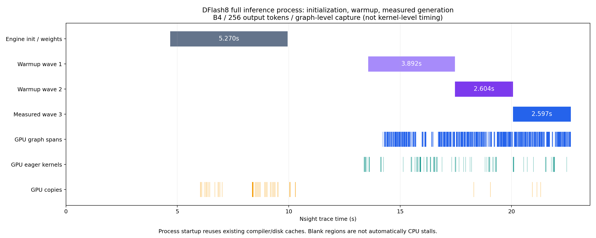
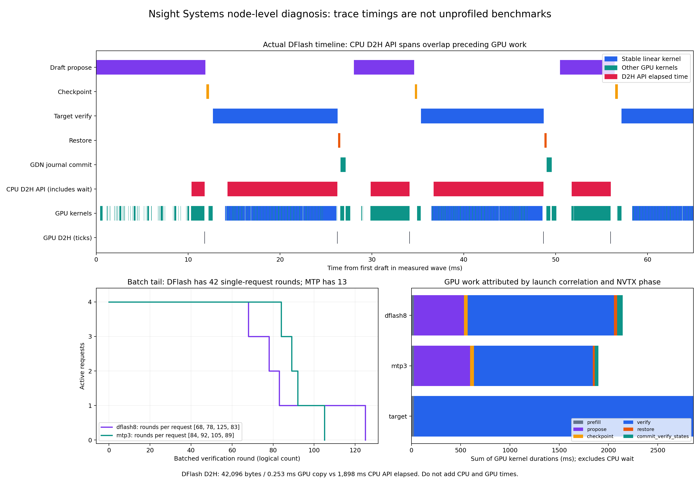

# Qwen3.5-4B / MiniSGLang：Nsight Systems 推理时间线分析

日期：2026-09-20。运行代码基线：`15ca41766f139acffc06859efc39c73c9b9d622a`，分支 `feat/hybrid-memory-runtime`。

本次完成四份原生 `.nsys-rep`、SQLite/CSV 导出、NVTX 阶段标记、无 profiler 性能对照和精度检查。新增的是诊断工具，没有改动推理数学或声称实现新的加速。此前 allocator admission 优化已包含在上述代码基线中。

原生 trace、SQLite 及日志不提交 Git；下面的文件链接用于下载到本地的完整证据目录。在云端可从文末路径取得它们。

## 1. 可以直接打开的文件

在 **NVIDIA Nsight Systems GUI** 中选择 File → Open；建议使用采集同版本 2025.1.1。虽然服务器程序位于 `nsight-compute` 目录，文件仍应由 **Systems** GUI 打开。四个报告均已经由服务器 nsys 成功导出为 SQLite 和统计 CSV；本次没有在本机 GUI 手动打开验证。

| 文件 | 用途 | 抓取粒度 |
|---|---|---|
| [dflash8_full_graph.nsys-rep](dflash8_full_graph.nsys-rep) | 优先打开，查看初始化、预热、正式推理完整流程 | CUDA Graph 整图活动，含显存 API 跟踪 |
| [dflash8_steady_node.nsys-rep](dflash8_steady_node.nsys-rep) | DFlash 稳态瓶颈、Graph 内部 kernel | 节点级，第三波推理 |
| [mtp3_steady_node.nsys-rep](mtp3_steady_node.nsys-rep) | MTP3 稳态对照 | 节点级，第三波推理 |
| [target_steady_node.nsys-rep](target_steady_node.nsys-rep) | target-only 稳态对照 | 节点级，第三波推理 |

展开 CUDA HW/GPU streams、CUDA API、进程线程下的 NVTX。搜索 `inference/wave_3`，再查看 `speculative/propose`、`verify`、`checkpoint`、`restore`、`commit_verify_states`。全流程文件第三波约在时间轴 **20.06–22.66 秒**。

`Layer_* / MLP / GatedDeltaNet` 等 Python NVTX 主要出现在 eager 执行或图捕获时；Graph replay 不会重新执行 Python 标记。节点级报告可以展开重放 kernel，但不能假设每个重放 kernel 都有重新生成的层级 NVTX。

## 2. 实验口径与精度

- RTX 4090 24GB；驱动 595.71.05；Torch 2.9.1+cu128；CUDA 12.8；Triton 3.5.1；Nsight Systems 2025.1.1.0。
- 目标权重：`/root/autodl-tmp/models/hybrid-runtime/Qwen3.5-4B`；DFlash：同级 `Qwen3.5-4B-DFlash`。
- 固定四条 prompt，batch=4，输出上限 256，本次各请求实际输出 256 token；context capacity=4096，stable target numerics，parallel verify，packed GDN，CUDA Graph 开启。
- prefix cache 配额设为零，避免缓存命中干扰。本报告不衡量 HiCache。
- 预热两波，然后捕获第三波。无 profiler 对照另起进程，预热两波、测量三波。工作负载保存在 `inputs-256.jsonl`，具体参数见各 `*-manifest.json`。
- 四份 profile 输出均与本轮 target-only 对照的相同 prompt **逐 token 完全一致**，见 `accuracy-checks.json`。无 profiler 三模式比较也通过精度门禁，见 `unprofiled-comparison.json`。这是固定工作负载上的 greedy 验证，不代表所有输入或随机采样均已穷尽验证。
- 最新 CPU/GPU 测试：**139 passed in 8.59s**，见 `final-tests.log`。测试命令禁用了项目默认 coverage 参数，因为当前环境没有对应插件；没有安装新依赖。

| 模式 | 无 profiler 输出吞吐 tok/s | 相对 target | 无 profiler 单波耗时中位数 | 节点级 profile 单波耗时 |
|---|---:|---:|---:|---:|
| target-only | 331.20 | 1.000× | 3091.59 ms | 3404.70 ms |
| MTP3 | 483.67 | **1.460×** | 2114.34 ms | 2315.30 ms |
| DFlash8 | 411.65 | **1.243×** | 2499.14 ms | 2744.37 ms |

这里吞吐为该 benchmark 记录的端到端生成吞吐，包含该波 prefill，不是纯 decode-only tok/s，也不是服务端在线请求延迟。节点级抓取相比对应中位数高约 9.5–10.1%；整图级 DFlash 为 2596.87 ms，高约 3.9%。这是少量顺序运行的校准，不能当作固定开销常数。**不能使用 profile 耗时冒充线上性能。**

## 3. 完整推理流程



该图由真实 SQLite 事件生成，不是示意图。时间相对于 nsys 会话起点。

| 阶段 | 开始 | 持续 |
|---|---:|---:|
| runtime/main | 3.718 s | 19.307 s |
| Engine 初始化 | 4.683 s | 5.270 s |
| 第一波预热 | 13.568 s | 3.892 s |
| 第二波预热 | 17.460 s | 2.604 s |
| 正式第三波 | 20.064 s | 2.597 s |

Engine 初始化包含目标模型加载等工作，后续区间还有 draft 初始化和 Graph 准备；现有 NVTX 没有进一步独立划分它们，不能把间隙全部归给某一模块。首波还会碰到首次执行/形状准备，因此明显较慢。

这是一个新进程的完整启动轨迹，**复用了已有 Triton 编译缓存及可能存在的系统文件缓存**，不属于清空所有缓存后的机器冷启动。

全流程报告按 Graph 整图记录，第三波有 354 个 graph span、约 1944 ms span 时长，以及约 195 ms eager kernel。Graph span 内部可能含空隙；不能拿这里的 eager kernel 总和与节点级报告全部 kernel 总和直接比较。

## 4. DFlash 主要卡在哪里



上图的局部时间线取自真实 DFlash 稳态；下方分别展示各请求结束造成的 batch 拖尾，以及 CUDA kernel 按阶段归属的累计时间。CPU 区间与 GPU 区间会重叠，不能相加当成总耗时。

### 4.1 主要 GPU 工作量在 target verify 和线性层

| GPU kernel 时间累计 | target-only | MTP3 | DFlash8 |
|---|---:|---:|---:|
| Prefill | 24.83 ms | 24.79 ms | 24.78 ms |
| Draft/propose | — | 571.74 ms | 509.78 ms |
| Target verify/decode | 2837.52 ms | 1206.63 ms | **1485.56 ms** |
| Checkpoint | — | 37.28 ms | 35.50 ms |
| Restore | — | 21.20 ms | 32.82 ms |
| Commit verify states | — | 35.87 ms | 55.12 ms |
| 总和 | 2862.35 ms | 1897.51 ms | 2143.55 ms |

阶段归属根据 NVTX、CUDA runtime correlation ID 和调用线程匹配，分析脚本记录全部 kernel 均有归属。这些是 kernel 持续时间之和，不是阶段 wall time，也不是 GPU 硬件利用率。

DFlash 中 `_linear` 累计 **1335.93 ms，占 kernel 时间 62.3%**，共 19278 次调用。其次 `_extend_kernel` 约 106.29 ms（5.0%）、`_copy_slots` 68.32 ms（3.2%）。因此下一步优先调查实际形状的线性层效率及 verify 工作量，而不是默认把所有 Triton 改写为 CUDA。

当前 stable linear 的一个大项是 grid=(2,288)，按 BN=64 对应 N=18432，累计约 315.12 ms；应结合调用位置调查 fused gate/up 等相应投影。N=2560 的形状可对应多个投影，不能只凭形状唯一指认某一层。LM head 也不是全部 62.3% 的来源。

### 4.2 看起来很慢的 D2H，绝大多数是在等待

DFlash 第三波：

- 250 次 D2H，总计 **42096 字节**，实际 GPU copy 时间合计 **0.253 ms**。
- 对应 CPU `cudaMemcpyAsync` API 耗时合计 **1897.91 ms**，目的地均为 pageable host memory。
- H2D 约 80 KB、0.437 ms；D2D 约 3.46 GB、8.09 ms。D2D 数字不包含 Triton 状态复制 kernel 产生的所有显存流量。

这说明 CPU API 很大部分在等待先前 GPU 工作完成。不能解释成“42KB 传输用了 1.9 秒”，也不能预测去掉拷贝就能直接节省 1.9 秒。MTP 和 target-only 同样出现 CPU 等待远高于真实拷贝时间的情况。

下一步有价值的实验是让 draft token / greedy acceptance 更多留在 GPU，只回传必要的紧凑结果，减少 CPU 往返和发射间隙；但 preceding GPU compute 仍必须完成。必须用无 profiler A/B 测量收益，不能减去 CPU API 时间估算加速。

### 4.3 DFlash 的 batch 拖尾比 MTP 更严重

| 项目 | DFlash8 | MTP3 |
|---|---:|---:|
| 接受 draft token / proposal token | 666 / 2440 | 650 / 1102 |
| 接受率 | **27.30%** | **58.98%** |
| 每个请求的轮数 | 68、78、125、83 | 84、92、105、89 |
| 仅剩一个请求的逻辑轮数 | **42** | **13** |
| 各轮平均活跃请求数 | 2.832 | 3.524 |

DFlash 为 B4×68、B3×10、B2×5、B1×42；MTP 为 B4×84、B3×5、B2×3、B1×13。这四条请求开始时是真实并行执行，不是串行。后面请求先后完成，且该有限工作负载没有新请求补入，因此 batch 会收缩。

DFlash 的平均每请求每轮输出约 2.88 token，甚至略高于 MTP 的 2.76，但慢请求需要更多全局轮次，末尾也更薄。平均接受率、平均进度都不足以解释总性能，需要同时看请求差异和活跃 batch。持续有新请求补入时拖尾结论可能不同，不能将此处 42 轮直接推广到饱和在线服务。

本次 MTP 的 draft kernel 时间反而高于 DFlash（572 vs 510 ms）；MTP 主要赢在 verify 总工作量较少、拖尾较短。不能简化成“MTP draft 总是更便宜”。

### 4.4 CUDA Graph 已生效，但不是零 fallback

DFlash：draft graph 118 次、fallback 6 次；verify graph 118 次、eager verify 6 次、decode graph 1 次。总计 113284 个 kernel，其中 105392 个为 graph kernel node，约 93.0%。MTP draft/verify graph 各 101 次，fallback 各 3 次。

应继续按实际形状检查尾部和首轮 fallback 是否值得补图，但节点覆盖率不是时间覆盖率；也不应为了消除少数 fallback 无限增加图数量和显存。

DFlash 测量区间没有 `cudaMemGetInfo`，符合前一轮 admission fast path 的目标。节点级 CPU `feasible_blocks` 仍累计约 41.40 ms，可继续分析，但不是目前最大的 GPU 热点。

## 5. 建议的优化顺序与验证门禁

1. **先改 CPU/GPU token 交互方式的小范围实验**：检查 draft 和 verify 之间哪些 token 搬回 CPU 后又送回 GPU，探索设备端 greedy acceptance 和必要结果批量回传。保持拒绝、EOS、不同接受长度、GDN rollback 和 KV 生命周期语义；与当前 stable target 做逐 token 门禁。
2. **针对尾部选择 speculation 策略**：结合活跃 batch、各请求最近进度、verify 成本和上下文，比较缩短 block、局部关闭投机、请求补入等策略。先固定工作负载 A/B，再增加持续到达负载；不能仅看到低接受率就统一缩 block。
3. **用真实形状优化 stable linear**：先 ncu 对主要投影抽样，确认访存、occupancy、tensor core 指令利用、wave 数，再做 tile/fusion/layout 实验。改 reduction 顺序或用其他 GEMM 路径可能改变 greedy token，性能和精度必须共同过门禁。
4. **状态复制为后续项**：本次 `_copy_slots` 约占 3.2%，不是头号热点。GDN journal 不等于保存了全部中间 recurrent state，checkpoint 仍有回退语义；不能直接删掉 checkpoint 追求表面加速。

以上为依据本次 trace 得出的下一轮实验建议，**本次未实现、也未宣称这些建议已经产生性能提升**。每次保留不可变基线、冷/暖分离、无 profiler 多轮交替测量，并记录 graph fallback、接受率、峰值显存及 batch 拖尾。

本次没有启用 GPU 硬件计数器，也没有 CPU sampling/context-switch 跟踪。因此不能据此断言线性层已达到 DRAM 带宽极限、SM 已饱和，或准确归因所有 CPU 空白区间。节点级记录的 GPU 活动区间并集覆盖率约为 DFlash 78.4%、MTP 82.2%、target 84.3%；它包含 profiler 干扰，**不是硬件利用率**，剩余比例也不能全部视为可消除的 Python 开销。

## 6. 复现与证据文件

`profile_nsys.py` 已放入仓库 `benchmark/runtime/`；`run-captures.sh`、`run-controls.sh` 保存了本轮完整命令。脚本中的输出目录是本次固定路径，复跑时须换一个新目录并复制 `inputs-256.jsonl`，不要覆盖现有证据。

在 `/root/mini-sglang` 中：

```bash
export PYTHONPATH="$PWD/python" OMP_NUM_THREADS=4 TOKENIZERS_PARALLELISM=false
NSYS=/opt/nvidia/nsight-compute/2025.1.1/host/target-linux-x64/nsys
# 将 NEW_OUT 设为新的输出目录，并把 inputs-256.jsonl 放进去。
"$NSYS" profile --trace=cuda,nvtx,osrt --sample=none --cpuctxsw=none \
  --capture-range=cudaProfilerApi --capture-range-end=stop \
  --cuda-graph-trace=node --output "$NEW_OUT/dflash8_steady_node" \
  python benchmark/runtime/profile_nsys.py --scope wave --capture-wave 3 \
  --manifest "$NEW_OUT/dflash8_steady_node-manifest.json" -- \
  --model /root/autodl-tmp/models/hybrid-runtime/Qwen3.5-4B \
  --draft /root/autodl-tmp/models/hybrid-runtime/Qwen3.5-4B-DFlash \
  --mode fixed --block-size 8 --batch-size 4 --max-context 4096 \
  --target-numerics stable --verify-mode parallel --gdn-extend packed \
  --cuda-graph --gpu-cache-mib 0 --host-cache-mib 0 --warmup 2 --repeat 1 \
  --workload "$NEW_OUT/inputs-256.jsonl" --output "$NEW_OUT/result.json"
```

完整流程改为 `--scope all`，删除两个 capture-range 选项，使用 `--cuda-graph-trace=graph --cuda-memory-usage=true`。MTP 使用 `--mode mtp --mtp-steps 3` 并移除 draft/block-size；target 使用 `--mode target` 并移除 draft/block-size。

`profile_nsys.py` 不同时启用 Torch Profiler，避免 CUPTI 竞争；所有生成波次都会标记 `profiled=true`，防止把诊断数据误报为性能结果。

证据包括：四份 `.nsys-rep` 及同名 SQLite、各类 stats CSV、完整运行日志、manifest、逐 token JSON、`analysis.json`、`analyze_nsys.py`、`plot_nsys.py`、`accuracy-checks.json`、`unprofiled-comparison.json`、`final-tests.log`。`SHA256SUMS` 对下载的采集证据逐文件校验，报告为采集后新增文件，不在原始校验列表中。

原始云端目录：`/root/autodl-tmp/runtime-results/nsys-20260920-113841`。本地保存同一批原生文件，可直接复制给安装了 Nsight Systems GUI 的机器。
