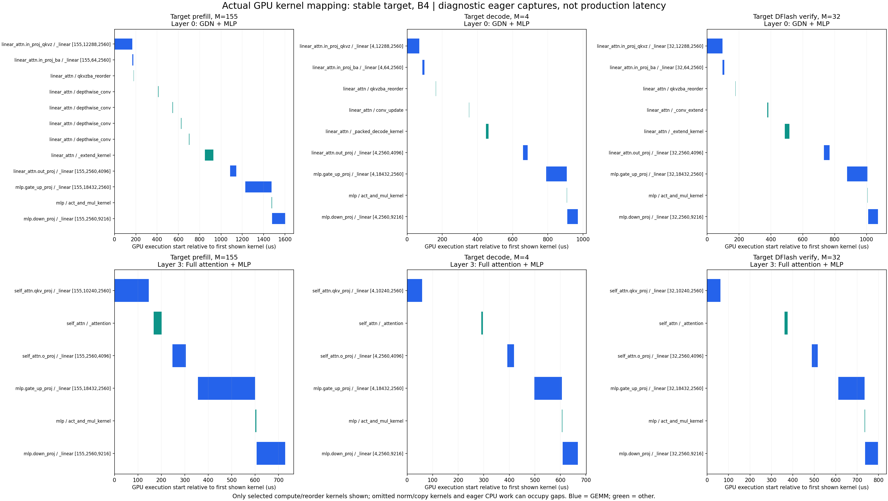

# Qwen3.5 推理算子地图：怎样在 Nsight Systems 中看真正的计算

2026-09-20；运行基线 c5da570；4090，Torch 2.9.1+cu128，Nsight Systems 2025.1.1。新增代码只有可选的诊断标记，没有改变模型计算。

## 先解释两张截图

第一张中 GPU 的 `CUDA HW` 和线程的 `CUDA API` 都未展开。第二张中正在看的区间属于 `speculative/propose`，即 DFlash draft，不是 target prefill。图上 CPU API 行两个矩形之间的距离，不能直接解释成 GPU 空闲。

| 行 | 显示什么 | 能否据此判断 GPU 计算耗时 |
|---|---|---|
| NVTX | 程序标记的 CPU 作用域，如 Layer、MLP、draft、verify | 不能直接当 GPU 时间；里面可含 Python、launch、等待 |
| 线程 → CUDA API | CPU 上 CUDA Runtime/Driver 调用；某些 launch 在 GUI 中会以关联 kernel 名显示 | 不能把这里的矩形长度/间隔当 GPU 执行时间 |
| CUDA HW → CUDA context → stream 的 kernel | GPU 真正执行的 kernel，包括 Triton、cuBLAS、CUTLASS 等 | 用这里的起止时间看计算和调度间隙 |

所以 `cutlass::Kernel...gemm...` 真正执行在 GPU stream/kernel 行。API 行即便显示相同名字，也仍应查看 tooltip 的事件类别，并点选事件看 CPU launch 与 GPU kernel 的关联。第二张顶部 Kernel 汇总条显示这段时间存在 GPU 活动；它是折叠汇总，不能据此判断精细利用率，也不支持“API 空白就是整段 GPU 空泡”的结论。

展开第一张左侧 `CUDA HW` 的箭头，继续展开 context/stream。隐藏无关的 epoll/poll 后台线程，只保留主线程 NVTX/CUDA API 和 GPU stream，再缩放到一个 layer。真正的 GPU idle 要检查所有相关 stream，而不是只看一个 CPU 线程。

Nsight 的两类 CUDA trace 的定义见 [NVIDIA 官方说明](https://docs.nvidia.com/nsight-systems/UserGuide/#cuda-trace)。

## 为什么旧 full_graph 文件不够适合看算子

旧文件使用 `--cuda-graph-trace=graph`：Graph replay 主要记录整图活动，内部节点不逐个展开。这是低开销的全流程观察文件，不是逐算子诊断文件。已有的 `steady_node` 文件可以看 kernel，但抓取前已经创建了许多 Graph，重放不会再次执行 Python 层级 NVTX，所以层与 kernel 的对应关系不直观。

这次补了三份原生报告：

| 文件 | 怎么用 |
|---|---|
| [dflash8_full_node_operators.nsys-rep](dflash8_full_node_operators.nsys-rep) | Graph 开启，B4×256；从进程启动开始采集节点、初始化、图构建、预热和正式推理；看真实 Graph kernel 与整体流程 |
| [target_eager_operators.nsys-rep](target_eager_operators.nsys-rep) | **先打开这份学算子对应关系**。Graph 关闭，B4×16，预热两波后抓第三波；看 target prefill 和单 token decode 的层路径、形状和 kernel |
| [dflash8_eager_operators.nsys-rep](dflash8_eager_operators.nsys-rep) | Graph 关闭，B4×16；看 draft 与 target verify，以及 GDN commit/restore 的区别 |

后两份是人为关闭 Graph 的诊断，不代表生产性能；16 token 还改变了尾部 block 形状，不能拿它们的接受率/吞吐对比原 B4×256 性能。三份文件均通过 nsys 原生导出，不是 Chrome trace。推荐同版本 Nsight Systems GUI 打开。

新增 NVTX 例如：

```text
op/target.model.layers.0.linear_attn/GDN[X=155x2560]
op/target.model.layers.0.linear_attn.in_proj_qkvz/GEMM[M=155,N=12288,K=2560;triton_stable]
op/target.model.layers.0.mlp.gate_up_proj/GEMM[M=4,N=18432,K=2560;triton_stable]
op/target.model.layers.3.self_attn/FullAttention[X=4x2560]
op/draft.layers.0.mlp.gate_up_proj/GEMM[M=32,N=18432,K=2560;torch]
op/SDPA.torch[Q=4x32x8x128;K=4x8x50x128;V=4x8x50x128]
```

**GPU kernel 本身的名字没有被伪造或改写**。`_linear` 还是 `_linear`；新 NVTX 和 CSV 负责解释它具体属于哪层、哪个投影、什么形状。Graph 重放也不会重新运行这些 Python 标记，不能把重放阶段缺少层标签当成没有执行那一层。

## 实际 target 算子清单

这份模型文本部分是 32 层：24 层 GDN、8 层 Full Attention；第 0/1/2 层为 GDN，第 3 层为 Full Attention，每四层重复。本次使用 `--target-numerics stable --gdn-extend packed`，不是默认最快的 cuBLAS/FlashAttention 全路径。

以下 GEMM 写成 `X[M,K] × W[N,K]^T → Y[M,N]`。实际观测：prefill 四条输入合计 **M=155**；B4 单 token decode **M=4**；DFlash 首轮 B4、block8 verify **M=32**。最后几轮/不齐整批次的 M 会变化。prefill 的 LM head 只选择每条请求最后一行，因此其 M=4，不是 155。

| 模块/计算 | 矩阵/状态形状 | 实际 kernel 名 | 路径说明 |
|---|---|---|---|
| GDN `in_proj_qkvz` | K=2560，N=12288 | `_linear` | Triton stable GEMM；Q/K 各2048，V/Z 各4096 |
| GDN `in_proj_ba` | K=2560，N=64 | `_linear` | 两组32个 value-head gate，不是大输出 GEMM |
| GDN QKVZ/BA 整理 | Q/K/V/Z 拆分、reshape、重排 | `fused_qkvzba_split_reshape_cat_contiguous_kernel` | Triton 数据整理；不是注意力矩阵乘 |
| GDN prefill convolution | depthwise conv，kernel size=4 | `conv_depthwise2d_forward_kernel_generic` | 本次 prefill 实际为 PyTorch depthwise 卷积路径 |
| GDN decode convolution | 更新每请求 conv state | `_causal_conv1d_update_kernel` | Triton |
| GDN packed verify convolution | block token + conv state | `_conv_extend` | Triton；不要与 prefill 卷积混为一谈 |
| GDN prefill / packed verify 核心 | 每请求32个 value heads，每头128×128 FP32 recurrent state | `_extend_kernel` | Triton；kernel 内按 token 递推，非 chunk-parallel WY 算法 |
| GDN 单 token decode 核心 | 同上，单步更新 | `_packed_decode_kernel` | Triton；归约、状态外积更新和读写，不是大型 GEMM |
| GDN `out_proj` | K=4096，N=2560 | `_linear` | Triton stable GEMM |
| Full Attention `qkv_proj` | K=2560，N=10240 | `_linear` | 含 Q 输出 gate；2×4096 + K1024 + V1024 |
| Full Attention 核心 | Q heads=16，KV heads=4，head dim=256 | `_attention` | 自定义 stable paged attention；在本路径 prefill/decode/verify 都不是 FlashAttention kernel |
| Full Attention `o_proj` | K=4096，N=2560 | `_linear` | Triton stable GEMM |
| MLP `gate_up_proj` | K=2560，N=18432 | `_linear` | gate/up 合并 GEMM；中间维9216 |
| MLP SiLU×up | 两个9216分支做激活和逐元素乘 | `act_and_mul_kernel` | FlashInfer CUDA 激活算子，不是 GEMM |
| MLP `down_proj` | K=9216，N=2560 | `_linear` | Triton stable GEMM |
| Target LM head | K=2560，N=248320 | `_linear` | 该 benchmark 的 stable head，输出 FP32 logits |

另外会看到 `RMSNorm...`、`FusedAddRMSNorm...`、QK RoPE、`elementwise_kernel`、cat、copy、state journal 等辅助 kernel。**带 `cutlass` 前缀不保证是 GEMM**：本次某些 FlashInfer norm kernel 名中也有 `kernel_cutlass...rmsnorm...`。要读完整符号及关联算子。

源码入口：`models/qwen3_5.py`、`models/utils.py`、`layers/linear.py`、`speculative/numerics.py`、`kernel/triton/invariant.py`、`gdn_decode.py`、`gdn_extend.py`、`conv_extend.py`、`gdn_fused_proj.py`。所有归属以运行记录为准，不能只看模型结构猜使用了哪个后端。



图中列依次为 prefill、普通 decode、DFlash verify；行分别为第0层 GDN+MLP、第3层 Full Attention+MLP。蓝色是实际 GEMM kernel，绿色是其他选定计算/重排 kernel。为清楚起见省略 norm、copy 等辅助项；**图中空隙可能包含这些被省略的工作以及 eager CPU 发射开销，不等于 GPU idle**。形状括号为 `[M,N,K]`。

逐 kernel 的完整名称、层路径、形状、GPU 开始时间、耗时、correlation ID 在 `*-events.json`；汇总见 `*-mapping.csv`。分析按 launch correlation ID 与嵌套 NVTX 做归属，target 8332、DFlash 11004 个 eager kernel 均匹配到 NVTX。`gui-locations.json` 提供图中代表性调用相对 wave_3 的定位时间。

## DFlash draft 又是另一条路径

Draft 的 `F.linear` 仍调用 PyTorch/cuBLAS 系列库，不受 target stable `_linear` 替换。因此同一张图同时出现 `ampere_bf16...`、`cutlass::Kernel2...gemm...`、Triton `_linear` 完全正常。

本轮实际匹配到的例子：

| Draft 操作 | 首轮实例形状 | kernel / 路径 |
|---|---|---|
| 多层 target features → draft hidden 的 FC | M=168，N=2560，K=20480 | `ampere_bf16_s1688gemm_bf16_128x64...` |
| 融合 context KV projection | M=168，N=12288，K=2560 | `cutlass::Kernel2<...tensorop_bf16...gemm...>` |
| 第0层 query-block QKV | M=32，N=6144，K=2560 | CUTLASS GEMM |
| 第0层 MLP gate/up | M=32，N=18432，K=2560 | `cutlass_80_wmma_tensorop_bf16_s161616gemm...` |
| 第0层 MLP down | M=32，N=2560，K=9216 | CUTLASS GEMM，某些形状还有 `splitKreduce_kernel` |
| Draft SiLU×up、RMS 等 | 小张量 | 自定义 Triton `_silu_mul`、`_rms` 等；以完整映射文件为准 |
| Draft LM head | 首轮 M=28，N=248320，K=2560 | CUTLASS GEMM；每请求预测7个 draft token，4×7=28 |

这里的 FC M=168 是实际 draft ragged context padding 后行数，不等于 target prefill 的155。`ampere` 名字不表示机器变成了 Ampere；这是库 kernel 命名，当前 GPU 仍是 Ada RTX4090。

**新的诊断发现：本次 draft SDPA 并未选择单个 fused FlashAttention kernel。** 实际 `Q=[4,32,8,128]`、`K/V=[4,8,50,128]` 的调用展开为 mask/cast、`gemmSN_TN_kernel<float>`、`softmax_warp_forward`、`gemmSN_NN_kernel<float>` 等 math 路径。旧 Graph 稳态文件也包含相同 math kernel 家族，所以不是仅新加 eager 标记才出现的现象。

这提供了后续实验方向，但不能直接宣称“这是唯一瓶颈”或“强制 Flash 就一定快”。需要检查真实 mask/GQA/stride/backend 支持条件，并测试 draft 接受率、target 输出、Graph 可捕获性和端到端收益。本次没有强制切换 SDPA backend。

## 到底是不是 compute-bound，是否因为模型太小

不能用 API 行的空白、模型参数量、kernel 名或使用 Tensor Core 直接下结论。需要分清：

1. **GPU 没有工作**：可能是 CPU 发射不及时、同步、分配、依赖等；在 GPU stream 时间线确认。
2. **GPU 在执行但算力利用不高**：小 M、tile 填充、并行度、内存访问、归约/依赖链等都可能导致。
3. **真正 compute-bound**：需要硬件指标确认计算单元吞吐接近瓶颈；这与“时间线上没有空隙”是不同问题。

对于 BF16 GEMM，粗略算术强度为 `2MNK / [2NK + 2MK + 2MN]` FLOP/byte。若权重读占主要流量，约为 M。于是同一层：B4 decode 的 M=4，首轮 verify 的 M=32，本次短 prompt prefill 的 M=155。它们的权重复用能力明显不同；这是简化模型，不含 cache 命中、tile 重读、padding 和中间数据，不能替代实际 DRAM 计数。

此外 stable `_linear` 固定 BM=16、BN=64、BK=64；M=4 的有效行不足一个16行 tile。它使用 `tl.dot`，已检查服务器一个 SM89 `_linear` 编译产物包含 `mma.sync.aligned.m16n8k16...bf16...`，说明 **Triton 也能使用 Tensor Core**。但“有 MMA 指令”不等于 Tensor Core 已饱和。

相反，当前 `_attention` 用 FP32 逐元素运算/归约做逐 query attention；GDN `_extend_kernel` / `_packed_decode_kernel` 用状态归约和更新，源码没有 `tl.dot` 大矩阵路径。尤其 GDN prefill 目前仍按 token 在 kernel 内递推。因此不能把这些部分的利用率问题全部归因于“4B 太小”；实现选择和输入形状同样重要。

本次没有 ncu 硬件计数器，不能报告“已证实 compute-bound / memory-bound”。建议下一轮只挑真实热点形状采样 SM/Tensor throughput、DRAM throughput、occupancy、register pressure/stall，再决定优化 GEMM tile、SDPA backend，还是 GDN 长 prefill 的 chunk-parallel 算法。后者涉及数值归约顺序变化，必须重新验证精度。

## 修改、验证和复现

- `benchmark/runtime/profile_nsys.py --operators` 可选开启。
- 新增 `benchmark/runtime/nsys_operators.py`，仅在诊断进程上下文中增加层/形状 NVTX；不改普通 benchmark 默认路径，不读回 GPU tensor，不主动增加逐算子 synchronize。
- 三份报告的实际输出与此前无 profiler target 基线逐 token 一致：完整 Graph 文件每请求256 token，两个 eager 文件每请求16 token，对应基线前16 token。
- 新一轮 CPU/GPU 测试 **139 passed in 8.22s**；ruff 通过。
- 所有结果标 `profiled=true`；本轮不发布新的性能提升数字。
- 完整复现命令在 `run.sh`。需要设置新的 `OPOUT` 输出目录并放入相应 JSONL；不要覆盖旧证据。
- 原始云端目录：`/root/autodl-tmp/runtime-results/nsys-operators-20260920-120915`。
- `.nsys-rep`、SQLite 和详细 events 不入 Git；工具及本说明提交到仓库，原始证据本地完整保留。`SHA256SUMS` 校验采集证据，说明文件是在采集后新增的。
